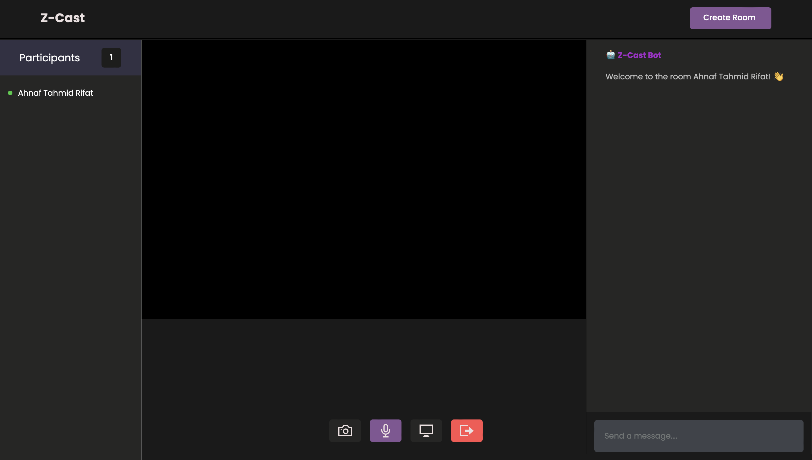

---

# Z Intensified Blog

Z Intensified Blog is a modern blogging platform designed for Gen-Z users, offering a space to share blogs, follow bloggers, and even start video podcasts. The platform integrates social features, personalized content discovery, and a sleek UI for an engaging blogging experience.

## Features

- **Follow Bloggers**: Stay updated with your favorite bloggers' content.
- **Search Functionality**: Find bloggers and posts through tags and keywords.
- **Video Podcasts**: Start a video podcast with real-time collaboration tools (screen sharing, video/audio calls).
- **Notifications**: Get instant alerts for new posts.
- **Engagement Options**: Like, comment, and share blogs.

## Getting Started

### Prerequisites

- Modern web browser (Chrome, Firefox, Safari, Edge)
- Stable internet connection

### Installation

1. Clone the repository:
   ```bash
   git clone https://github.com/iq-bal/z-intensified-blog.git
   cd z-intensified-blog
   ```

2. Install dependencies:
   ```bash
   npm install
   ```

3. Set up the environment:
   - Rename `.env.example` to `.env` and update necessary variables.

4. Run the development server:
   ```bash
   npm run dev
   ```

## Usage

- **Sign Up**: Register and start following bloggers, reading blogs, and creating podcasts.
- **Podcast Creation**: Start a video podcast from your dashboard with live interactions.

## Contributing

We welcome contributions! Feel free to submit pull requests or raise issues.

## License

This project is licensed under the MIT License.

--- 
